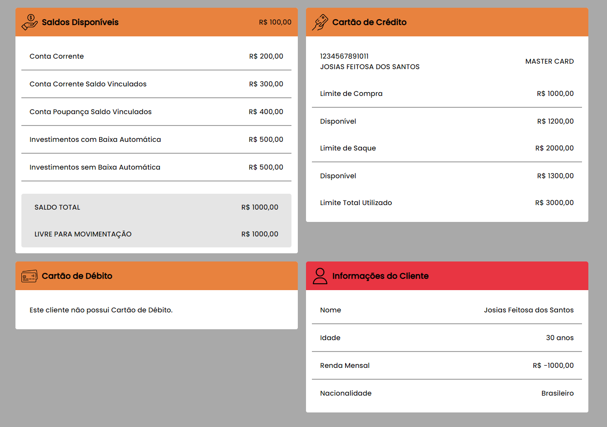

# Projeto de Cards com Diretivas - Angular 17

Este projeto foi desenvolvido para exemplificar o uso de diretivas no Angular 17, aplicadas na criação de diferentes cards que exibem informações financeiras, como saldos, cartões de crédito, cartões de débito e informações do cliente.

## 📸 Capturas de Tela



## 🎯 Objetivo

Demonstrar o uso de diretivas personalizadas e diretivas estruturais para estilizar e manipular elementos dinâmicos na interface, com foco em boas práticas e organização do código.

## 🛠️ Tecnologias Utilizadas

- Angular 17 (com uso de `import type`)
- TypeScript
- HTML5 e CSS3

## ⚙️ Funcionalidades Implementadas

### Card de Saldos Disponíveis

- Exibição de diferentes categorias de saldo com valores detalhados.
- Totalização dos valores disponíveis e livres para movimentação.

### Card de Cartão de Crédito

- Apresentação dos limites de compra, saque e total utilizado.

### Card de Cartão de Débito

- Exibe mensagem quando o cliente não possui cartão de débito.

### Card de Informações do Cliente

- Exibição de informações pessoais, como nome, idade, renda mensal e nacionalidade.

## 🧰 Recursos Utilizados

### Diretivas Criadas

#### `appHighlightCard`

- Aplica destaque em cards selecionados.

Exemplo de uso:

```html
<div appHighlightCard>
  <!-- Conteúdo do card -->
</div>
```

#### `appShowIf`

- Exibe ou oculta elementos dinamicamente com base em condições.

Exemplo de uso:

```html
<div *appShowIf="hasDebitCard">
  <!-- Conteúdo visível somente se hasDebitCard for true -->
</div>
```

### Diretivas Angular Nativas Utilizadas

- `*ngIf` para controle condicional.
- `*ngFor` para iteração de listas de dados.

## 🚀 Como Executar o Projeto

### Clonar o repositório:

```bash
git clone https://github.com/josiassantos15/cards-com-projecao-angular.git
```

### Instalar as dependências:

```bash
npm install
```

### Executar o servidor de desenvolvimento:

```bash
ng serve
```

### Acessar no navegador:

Abra [http://localhost:4200](http://localhost:4200) para visualizar a aplicação.

## 📂 Estrutura do Projeto

```plaintext
src/
├── app/
│   ├── components/
│   │   ├── balance-card/
|   |   |── card/
|   |   |    |──directives/
│   │   |    |  ├── base/
│   │   |    |  |   ├── card-content.directive.ts
│   │   |    |  |   ├── card-header.directive.ts
│   │   |    |  ├── icons/
│   │   |    |  |   ├── card-large-icon.directive.ts
│   │   |    |  |   ├── card-medium.directive.ts
│   │   |    |  ├── texts/
│   │   |    |  |   ├── card-description-text.directive.ts
│   │   |    |  |   ├── card-title-text.directive.ts
│   │   |    ├── card.component.ts
│   │   ├── card-item/
│   │   ├── card-line/
│   │   ├── card-title/
│   │   ├── client-infos-card/
│   │   ├── credit-card/
│   │   ├── debit-card/
│   │   └── cliente-info-card/
│   └── app.component.ts
├── assets/
└── styles.css
```

## 🧑‍💻 Autor

Desenvolvedor: Josias Santos
Email: josiassantos.contato@gmail.com